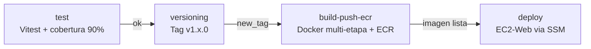

# ep03-frontend

Frontend del sistema **Alumnos**, construido con **React 18** y **Vite 6**. Interfaz CRUD completa con soporte para importacion/exportacion CSV, servida por **Nginx** como proxy inverso hacia la capa App.

---

## Tecnologias

| Tecnologia              | Version  | Uso                              |
| ----------------------- | -------- | -------------------------------- |
| React                   | 18.3     | Framework UI                     |
| Vite                    | 6.0      | Build tool y dev server          |
| Axios                   | 1.7      | Cliente HTTP                     |
| Nginx                   | 1.27     | Servidor estatico + proxy inverso |
| Vitest                  | 2.1      | Test runner                      |
| Testing Library / React | 16.1     | Tests de componentes             |
| MSW (Mock Service Worker) | 2.7    | Mocking de API en tests          |
| Node.js                 | 20       | Entorno de build                 |

---

## Estructura del proyecto

```
ep03-frontend/
├── src/
│   ├── api/
│   │   └── ep03.js          # Cliente Axios — llamadas al backend
│   ├── components/
│   │   ├── AlumnoForm.jsx      # Formulario crear/editar alumno
│   │   ├── AlumnoTable.jsx     # Tabla con acciones editar/eliminar
│   │   └── CsvPanel.jsx        # Panel importar/exportar CSV
│   ├── hooks/
│   │   └── useAlumnos.js       # Hook con toda la logica de estado
│   ├── test/
│   │   ├── api/                # Tests del cliente HTTP
│   │   ├── components/         # Tests de componentes React
│   │   ├── hooks/              # Tests del hook useAlumnos
│   │   ├── mocks/              # Handlers MSW y servidor mock
│   │   ├── App.test.jsx        # Test de integracion del App
│   │   └── setup.js            # Configuracion global de tests
│   ├── App.jsx                 # Componente raiz
│   ├── index.css               # Estilos globales
│   └── main.jsx                # Entry point
├── Dockerfile                  # Build multi-etapa (Node + Nginx)
├── docker-compose.yml          # Servicio standalone con red compartida
├── nginx.conf                  # Config Nginx con proxy dinamico
├── vite.config.js              # Config Vite + Vitest + cobertura
├── package.json
└── README.md
```

---

## Requisitos

| Herramienta    | Version minima |
| -------------- | -------------- |
| Docker         | 20.10+         |
| Docker Compose | 2.0+           |
| Node.js        | 20+ (solo para desarrollo local sin Docker) |
| npm            | 10+ |

---

## Inicio rapido con Docker

### Prerequisitos

Este compose asume que `ep03-backend` ya esta corriendo en la red `ep03-network`.

**1. Crear la red compartida (solo la primera vez):**
```bash
docker network create ep03-network
```

**2. Levantar la base de datos:**
```bash
cd ../ep03-db && docker compose up -d
```

**3. Levantar el backend:**
```bash
cd ../ep03-backend && docker compose up -d --build
```

### Levantar el frontend

```bash
docker compose up -d --build
```

### Verificar que esta corriendo

```bash
docker compose ps
```

Resultado esperado:

```
NAME          STATUS       PORTS
ep03-frontend   Up X seconds 0.0.0.0:80->80/tcp
```

### Abrir en el navegador

```
http://localhost
```

### Detener

```bash
docker compose down
```

---

## Desarrollo local sin Docker

### 1. Instalar dependencias

```bash
npm install
```

### 2. Levantar el dev server

```bash
npm run dev
```

La app queda disponible en `http://localhost:3000`.

El dev server incluye un proxy configurado en `vite.config.js`:

```
/ep03  →  http://localhost:8080
```

Requiere que `ep03-backend` este corriendo en `localhost:8080`.

### 3. Build de produccion

```bash
npm run build
# Salida en: dist/
```

### 4. Preview del build

```bash
npm run preview
```

---

## Funcionalidades

### CRUD de ep03

| Accion    | Descripcion                                      |
| --------- | ------------------------------------------------ |
| Listar    | Tabla con todos los ep03 registrados          |
| Crear     | Formulario con campos nombre y apellido          |
| Editar    | Formulario pre-cargado con datos del alumno      |
| Eliminar  | Confirmacion antes de borrar                     |

### Panel CSV

| Accion   | Descripcion                                           |
| -------- | ----------------------------------------------------- |
| Exportar | Descarga `ep03.csv` con todos los registros        |
| Importar | Pega CSV en el textarea y sube multiples ep03      |

Formato CSV esperado (sin encabezado):
```
Juan,Perez
Ana,Lopez
Carlos,Soto
```

### Stats en tiempo real

- Total de ep03 registrados
- Cantidad de apellidos unicos

---

## Proxy Nginx

En produccion, Nginx actua como proxy inverso hacia el backend. El hostname del backend se inyecta en runtime via la variable de entorno `BACKEND_HOST`:

```nginx
location /ep03 {
    proxy_pass http://${BACKEND_HOST}:8080/ep03;
}
```

| Entorno       | BACKEND_HOST       | Ejemplo                        |
| ------------- | ------------------ | ------------------------------ |
| Docker local  | `ep03-backend`      | nombre del contenedor          |
| AWS EC2       | IP privada         | `10.0.1.45`                    |

El reemplazo se realiza con `envsubst` al iniciar el contenedor, sin necesidad de rebuild.

---

## Tests

### Ejecutar todos los tests

```bash
npm test
```

### Ejecutar con cobertura

```bash
npm run test:coverage
# Reporte en: coverage/index.html
```

Umbral minimo requerido: **90% en lineas, funciones, ramas y sentencias**. Si no se alcanza, el build de Docker falla en la etapa de tests.

### Modo watch (desarrollo)

```bash
npm run test:watch
```

### Interfaz visual de tests

```bash
npm run test:ui
```

### Cobertura por modulo

| Modulo           | Descripcion                              |
| ---------------- | ---------------------------------------- |
| `src/api/`       | Tests del cliente Axios con MSW          |
| `src/components/`| Tests de renderizado e interaccion       |
| `src/hooks/`     | Tests del hook `useAlumnos`              |
| `src/App.jsx`    | Test de integracion del componente raiz  |

---

## Imagen Docker

| Propiedad    | Valor                  |
| ------------ | ---------------------- |
| Base build   | `node:20-alpine`       |
| Base runtime | `nginx:1.27-alpine`    |
| Imagen ECR   | `ep03-frontend:latest`   |
| Puerto       | `80`                   |
| Healthcheck  | `GET http://localhost` |

### Build multi-etapa

El Dockerfile usa 4 etapas para garantizar calidad y minimizar la imagen final:

| Etapa    | Base              | Descripcion                                      |
| -------- | ----------------- | ------------------------------------------------ |
| `deps`   | node:20-alpine    | Instala dependencias npm                         |
| `test`   | deps              | Ejecuta tests con cobertura (falla si < 90%)     |
| `build`  | test              | Genera el bundle de produccion con Vite          |
| `runtime`| nginx:1.27-alpine | Sirve los assets estaticos con proxy al backend  |

> Si los tests fallan, el build se detiene y no se genera la imagen.

### Construir la imagen manualmente

```bash
docker build -t ep03-frontend:latest .
```

### Publicar en ECR

```bash
# Autenticarse en ECR
aws ecr get-login-password --region us-east-1 \
  | docker login --username AWS --password-stdin <ECR_REGISTRY>

# Tag y push
docker tag ep03-frontend:latest <ECR_REGISTRY>/ep03-frontend:latest
docker push <ECR_REGISTRY>/ep03-frontend:latest
```

---

## Variables de entorno

| Variable       | Descripcion                          | Ejemplo          |
| -------------- | ------------------------------------ | ---------------- |
| `BACKEND_HOST` | Hostname o IP del backend (runtime)  | `ep03-backend`    |
| `VITE_API_URL` | URL del backend en dev server (build)| `http://localhost:8080` |

> `BACKEND_HOST` se usa en produccion (Nginx). `VITE_API_URL` se usa en desarrollo local (Vite proxy).

---

## Contexto en la arquitectura

Esta imagen forma parte de la infraestructura de 3 capas del sistema Alumnos:

```
Internet
   |
EC2-Web   (ep03-frontend:latest)    — Capa Web    — Puerto 80   <-- este servicio
   |  (proxy /ep03 → :8080)
EC2-App   (ep03-backend:latest)    — Capa App    — Puerto 8080
   |
EC2-Datos (ep03-db:latest)  — Capa Datos  — Puerto 5432
```

- Unico punto de entrada desde internet (SG-Web permite TCP 80 desde 0.0.0.0/0)
- Desplegada en `Subnet-Public` con IP publica asignada automaticamente
- El frontend no llama directamente al backend — todo pasa por el proxy Nginx
- La IP privada del backend se resuelve en tiempo de despliegue desde SSM Parameter Store

---

## Notas de seguridad

- El frontend no almacena credenciales ni tokens en el codigo fuente.
- `BACKEND_HOST` se inyecta en runtime, no en el build, evitando exponer IPs en la imagen.
- En produccion, el puerto 8080 del backend no esta expuesto publicamente — solo accesible desde el proxy Nginx interno.
- Los assets estaticos tienen cache de 1 año con `Cache-Control: public, immutable`.

---

## CI/CD — GitHub Actions

El pipeline esta definido en `.github/workflows/ci.yml` y se ejecuta automaticamente en cada `push` a cualquier rama. Orquesta cuatro jobs secuenciales: tests con cobertura, versionado semantico, publicacion en ECR y despliegue en AWS.

### Trigger

```
push → cualquier rama (**)
```

### Flujo del pipeline



> Si cualquier job falla, el pipeline se detiene y los jobs siguientes no se ejecutan.

---

### Job 1 — Test

Primer y unico guardian de calidad del frontend. Ejecuta la suite completa de tests con Vitest y verifica que la cobertura supere el umbral minimo del **90%** en todas las metricas.

**Suite de tests incluida:**
- Tests unitarios del cliente HTTP (`src/api/`)
- Tests de renderizado e interaccion de componentes (`src/components/`)
- Tests del hook de estado (`src/hooks/useAlumnos`)
- Test de integracion del componente raiz (`App.test.jsx`)
- Mocking de API con MSW (Mock Service Worker)

**Pasos:**
1. Checkout del codigo
2. Configura Node.js 20 con cache de dependencias npm
3. Instala dependencias con `npm install`
4. Ejecuta `npm run test:coverage` — tests + reporte de cobertura
5. Si la cobertura es menor al 90% en cualquier metrica (lineas, funciones, ramas, sentencias), el job falla y el pipeline se detiene
6. Publica el reporte de cobertura como artefacto (disponible 7 dias)

**Umbrales de cobertura:**

| Metrica    | Umbral minimo |
| ---------- | ------------- |
| Lineas     | 90%           |
| Funciones  | 90%           |
| Ramas      | 90%           |
| Sentencias | 90%           |

**Artefactos generados:**

| Artefacto | Contenido | Retencion |
|---|---|---|
| `coverage-report` | Reporte HTML + LCOV de cobertura | 7 dias |

> El reporte se publica con `if: always()` — esta disponible incluso si el job falla, lo que permite diagnosticar que modulos no alcanzan el umbral.

---

### Job 2 — Versioning

Calcula automaticamente la siguiente version semantica con esquema `v1.x.0` y crea el tag en el repositorio. Solo se ejecuta si los tests pasaron exitosamente.

**Logica de calculo:**
- Busca el ultimo tag existente con patron `v1.*`
- Si no existe ningun tag, inicia en `v1.0.0`
- Si existe, incrementa el numero menor: `v1.2.0` → `v1.3.0`
- Crea y publica el tag con `github-actions[bot]`

**Output:** `new_tag` — propagado a los jobs siguientes como identificador de version.

---

### Job 3 — Build & Push ECR

Construye la imagen Docker completa usando el `Dockerfile` multi-etapa del proyecto y la publica en Amazon ECR con dos tags simultaneos.

**Importante:** el Dockerfile del frontend incluye los tests como etapa de build (`test`). Esto significa que los tests se ejecutan **dos veces** en el pipeline: una en el Job 1 (para obtener el reporte de cobertura) y otra dentro del build de Docker (como gate de calidad de la imagen). Si los tests fallan dentro del build, la imagen no se genera.

**Etapas del Dockerfile ejecutadas en este job:**

| Etapa    | Descripcion                                      |
| -------- | ------------------------------------------------ |
| `deps`   | Instala dependencias npm                         |
| `test`   | Ejecuta tests con cobertura (falla si < 90%)     |
| `build`  | Genera el bundle de produccion con Vite          |
| `runtime`| Copia el bundle a Nginx con proxy configurado    |

**Pasos:**
1. Configura credenciales AWS desde los secrets del repositorio
2. Autentica en Amazon ECR
3. Configura Docker Buildx para builds optimizados
4. Construye y publica la imagen con dos tags:
   - `v1.x.0` — version inmutable para trazabilidad y rollback
   - `latest` — apuntando siempre a la version mas reciente

**Cache:** utiliza GitHub Actions Cache (`type=gha`) para reutilizar capas Docker entre ejecuciones y reducir el tiempo de build.

| Tag publicado | Ejemplo | Uso |
|---|---|---|
| Version semantica | `ep03-frontend:v1.3.0` | Rollback, trazabilidad |
| Latest | `ep03-frontend:latest` | Despliegue automatico |

---

### Job 4 — Deploy via SSM

Despliega la nueva imagen en la instancia `EC2-Web` sin necesidad de acceso SSH directo. A diferencia de las capas App y Datos, `EC2-Web` esta en la subnet publica y tiene acceso a internet, pero el deploy se realiza igualmente via SSM para mantener consistencia y auditabilidad.

**Pasos:**
1. Obtiene el Instance ID de `EC2-Web` desde **SSM Parameter Store** (`/ep03/ec2/web`)
2. Envia el comando `deploy-web.sh` a la instancia via `AWS-RunShellScript`
3. Hace polling del estado del comando cada 10 segundos (maximo 5 minutos / 30 intentos)
4. Si el comando termina en `Success`, imprime el output y el job finaliza exitosamente
5. Si termina en `Failed`, `TimedOut` o `Cancelled`, imprime el error y el job falla

**Comportamiento del deploy en EC2-Web:**
- Lee la IP privada de `EC2-App` desde SSM Parameter Store (`/ep03/ec2/app/private-ip`)
- Hace pull de `ep03-frontend:latest` desde ECR
- Detiene y elimina el contenedor anterior
- Levanta el nuevo contenedor con `BACKEND_HOST` configurado con la IP privada del backend
- Nginx reemplaza `${BACKEND_HOST}` en `nginx.conf` via `envsubst` al arrancar

---

### Secrets requeridos

| Secret | Jobs que lo usan | Descripcion |
| ------ | ---------------- | ----------- |
| `AWS_ACCESS_KEY_ID` | build-push-ecr, deploy | Credencial de acceso AWS |
| `AWS_SECRET_ACCESS_KEY` | build-push-ecr, deploy | Clave secreta AWS |
| `AWS_SESSION_TOKEN` | build-push-ecr, deploy | Token de sesion AWS (Lab Academy) |
| `AWS_REGION` | build-push-ecr, deploy | Region AWS (`us-east-1`) |

### Permisos

| Permiso | Nivel | Razon |
| ------- | ----- | ----- |
| `contents: write` | Repositorio | Crear y publicar tags git |

